# Nova Arcade

A retro games console for the ESP32-S3 2.8" board. A launcher loads games from the SD card, you play with a Bluetooth LE controller, and the whole thing can be flashed from a web browser.

**Install it:** https://drhammadkhan.github.io/nova-arcade/ (Chrome or Edge on a computer)

**Play it in a browser, no board needed:** https://drhammadkhan.github.io/nova-arcade/play/ (keyboard, any gamepad, or on-screen touch controls on a phone or tablet)

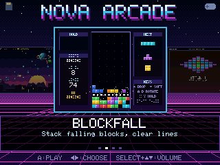

| | | |
|---|---|---|
| 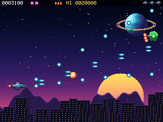 | 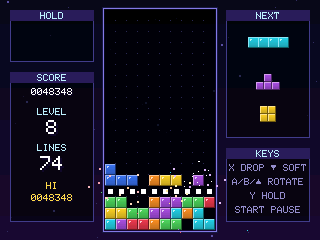 | 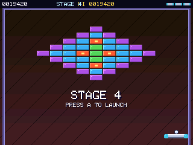 |
| **Nova Lance**, a shoot-'em-up | **Blockfall**, falling blocks | **Brick Storm**, brick-breaker |
| 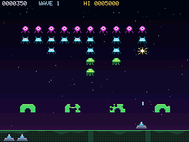 | 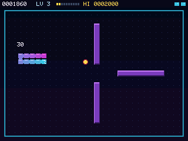 | 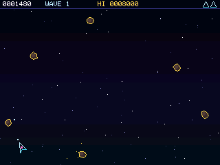 |
| **Alien Tide**, a wave shooter | **Neon Serpent**, a snake game | **Astro Drift**, a space-rock shooter |
| 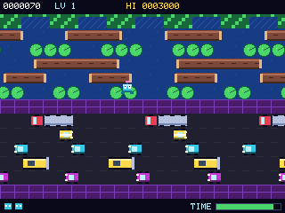 | 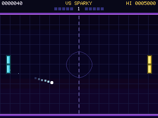 | 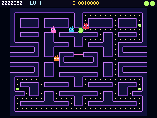 |
| **Hop Rush**, a road-and-river crossing | **Volt Rally**, paddle tennis | **Maze Munch**, a maze chase |
| 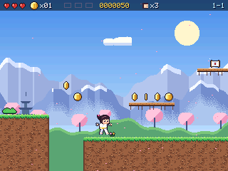 | 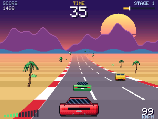 | 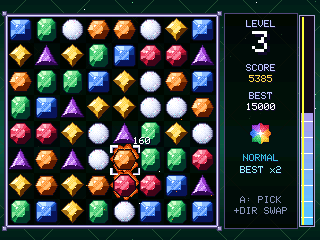 |
| **Pixel Peaks**, a platformer starring a little judoka | **Turbo Horizon**, a pseudo-3D road racer | **Gem Cascade**, a match-three puzzle |
| 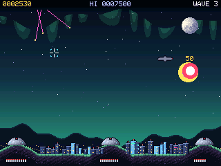 | | |
| **City Shield**, missile defence | | |

Every game has three difficulty levels. Choose Easy, Normal or Hard on its title screen with up/down. Slower is easier, and each difficulty keeps its own hi-score.

## Quick start

1. **Flash.** Open the [web installer](https://drhammadkhan.github.io/nova-arcade/), plug the board in over USB and press *Install on my board*.
2. **SD card.** Download `nova-arcade-sd-card.zip` from the same page and copy its `arcade` folder to a FAT32 microSD card.
3. **Play.** Pair a Stadia controller in Bluetooth mode by holding Y + Stadia for 2 seconds. Choose a game with the D-pad and press A.

| Anywhere | |
|---|---|
| START | Pause menu (resume / volume / quit) |
| SELECT + ↑/↓ | Volume |
| ↑/↓ on a title screen | Difficulty (Easy / Normal / Hard) |
| SELECT + START | Back to the launcher |

## How it works

```
flash (16 MB)
├── 0x000000  bootloader
├── 0x008000  partition table
├── 0x010000  factory  (2 MB)  Launcher: menu, reads the SD card
└── 0x210000  ota_0    (6 MB)  the game you picked
```

The launcher lives in the `factory` partition. When you pick a game, it copies `/arcade/<Game>.bin` from the SD card into `ota_0` and reboots into it. The first launch of each game takes a few seconds. After that, starting the same game again skips the copy. When a game starts, it sets the board to boot back into the launcher, so a reset, a power cycle or SELECT+START always returns to the menu.

Settings shared between games (volume, controller pairing) and each game's hi-score live in NVS, which survives switching games.

## Repository layout

```
Launcher/            the menu firmware (factory partition, custom partitions.csv)
games/<Game>/        one Arduino sketch per game, plus thumb.png and meta.txt for the SD card
lib/ArcadeCore/      shared engine: renderer, synth, input, pause menu, saves
tools/sim/           desktop simulator: run any game on your PC and save screenshots
tools/web/           WebAssembly entry point for the browser player (web/play/)
tools/art/           Python scripts that generate the pixel art
web/                 the browser flasher (ESP Web Tools, vendored)
scripts/             setup.sh (toolchain) and build.sh (everything)
```

## Building

With [arduino-cli](https://arduino.github.io/arduino-cli/) installed:

```bash
bash scripts/setup.sh    # esp32_bluepad32 core 4.1.0 + LovyanGFX 1.2.30
bash scripts/build.sh    # -> build/nova-arcade-full.bin, build/nova-arcade-sd-card.zip, build/site/
```

Every push to `main` builds everything on GitHub Actions and deploys the web installer to GitHub Pages. Pushing a `v*` tag also creates a release with the two downloads.

**Arduino IDE:** add the board URL
`https://raw.githubusercontent.com/ricardoquesada/esp32-arduino-lib-builder/master/bluepad32_files/package_esp32_bluepad32_index.json`,
install **esp32_bluepad32**, install **LovyanGFX**, and copy `lib/ArcadeCore` into your Arduino `libraries` folder. Then use board **ESP32S3 Dev Module** with Flash 16MB and PSRAM OPI.

## Other boards

Pins and display settings are in [`lib/ArcadeCore/src/arcade/Config.h`](lib/ArcadeCore/src/arcade/Config.h). On the tested board, 80 MHz and 40 MHz SPI caused pixel glitches, so it runs at 27 MHz.

## Controllers

The ESP32-S3 only supports **Bluetooth LE**. Working controllers: the Stadia controller (converted to Bluetooth mode), the Xbox Wireless controller (firmware v5+), and other BLE pads supported by [Bluepad32](https://bluepad32.readthedocs.io/). PS4/PS5, Switch Pro and 8BitDo pads use Classic Bluetooth and won't pair.

## Making games

See [docs/MAKING_GAMES.md](docs/MAKING_GAMES.md).

## Credits

[Bluepad32](https://github.com/ricardoquesada/bluepad32) by Ricardo Quesada, [LovyanGFX](https://github.com/lovyan03/LovyanGFX) by lovyan03, and [ESP Web Tools](https://github.com/esphome/esp-web-tools) (Apache-2.0). Game art and music are original.
